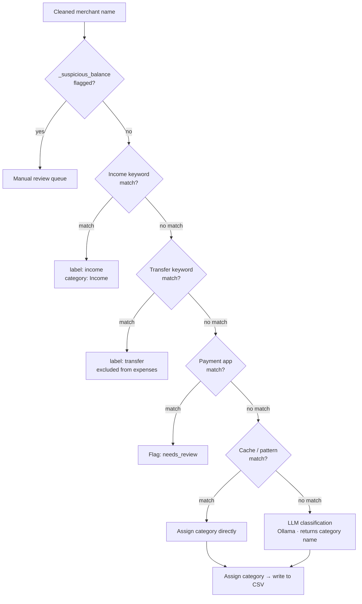

# Transaction Categorization

**Source file:** `src/ai_classification/categorizer.py`  
**Entry class:** `TransactionCategorizer`

---

## Overview

After a transaction's merchant name has been cleaned by the LLM pipeline, the categorizer assigns it to a spending category (e.g., `Groceries`, `Dining`, `Transportation`).

The categorizer uses a two-stage approach:
1. **Pattern matching** — fast keyword/regex rules from `config/`
2. **LLM classification** — Ollama-based fallback for ambiguous merchants

---

## Category List

Categories are defined in `config/categories.json`:

```json
[
  "Groceries",
  "Dining",
  "Transportation",
  "Fuel",
  "Utilities",
  "Housing",
  "Healthcare",
  "Entertainment",
  "Shopping",
  "Travel",
  "Education",
  "Personal Care",
  "Insurance",
  "Subscriptions",
  "Investments",
  "Income",
  "Transfer",
  "Other"
]
```

To add or rename a category, edit this file. The dashboard's pie chart and budget limits are all derived from this list.

---

## Classification Pipeline



### Stage 0: Suspicious Balance Routing

Before any keyword checks, transactions flagged `_suspicious_balance = True` by the parser are routed directly to the manual review queue. These are transactions where the parser detected that the extracted amount equals the previous row's running balance — a sign of a PDF column-collapse issue where the real amount was not captured. See [PARSING.md](PARSING.md) for details.

---

## Stage 1: Income Detection

`config/income_keywords.json` contains keywords that, if found in the merchant name or description, flag the transaction as income:

```json
{
  "keywords": [
    "DIRECT DEPOSIT",
    "PAYROLL",
    "SALARY",
    "ACH CREDIT EMPLOYER NAME"
  ]
}
```

Add your employer's name or any income sources here to ensure they are never counted as expenses.

---

## Stage 2: Transfer Detection

`config/transfer_keywords.json` lists patterns for inter-account transfers:

```json
{
  "keywords": [
    "ACH TRANSFER",
    "ONLINE TRANSFER",
    "TRSF",
    "WIRE TRANSFER",
    "MOBILE TRANSFER"
  ]
}
```

Matching transactions get `label: "transfer"` and are excluded from expense totals and charts.

---

## Stage 3: Payment App Flagging

`config/payment_apps.json` lists payment apps where the real spending detail is hidden:

```json
{
  "apps": [
    "Venmo",
    "Zelle",
    "Cash App",
    "PayPal",
    "Apple Pay Cash",
    "Google Pay"
  ]
}
```

These transactions are placed in a **needs_review** queue displayed in the dashboard's Transactions tab. You can manually assign the correct merchant and category from the UI.

---

## Stage 4: Pattern Matching

The merchant cache (built from previously processed CSVs) and in-memory category-to-keyword maps are checked before calling the LLM. Common merchant name substrings are matched case-insensitively:

```
Groceries: ["Whole Foods", "Kroger", "Safeway", "Trader Joe", "Publix", "Aldi"]
Fuel:      ["Shell", "BP", "Chevron", "Exxon", "Mobil", "Circle K"]
Dining:    ["McDonald", "Starbucks", "Chipotle", "Subway", "Domino"]
...
```

Matching is case-insensitive and substring-based. A merchant only needs to contain the pattern (e.g., `"Starbucks Coffee"` matches `"Starbucks"`).

---

## Stage 5: LLM Classification (Fallback)

When no pattern matches, the cleaned merchant name is sent to Ollama with a prompt like:

```
Given this merchant name: "Blue Moon Yoga Studio"
Classify it into exactly one of these categories:
[Groceries, Dining, Transportation, Fuel, Utilities, Housing, Healthcare,
 Entertainment, Shopping, Travel, Education, Personal Care, Insurance,
 Subscriptions, Investments, Income, Transfer, Other]
Return only the category name.
```

The LLM is constrained to the categories list, so it cannot invent new categories. If the LLM returns an unrecognized category, the transaction falls back to `Other`.

---

## Manual Review Workflow

The UI's **Transactions** tab shows a "Needs Review" section at the top for transactions that:
- Came through a payment app (Venmo, Zelle, etc.)
- Had a low-confidence LLM categorization
- Were manually flagged

For each review item, you can:
1. Edit the merchant name (typing the real merchant)
2. Select the correct category from a dropdown
3. Accept the change — it is saved back to the CSV and used as a high-confidence cache entry

---

## Learning from Corrections

Every time you correct a merchant name or category in the UI, that correction is written to the CSV. The next time the same raw merchant string appears (in any future month), `_load_user_corrections_from_csvs()` picks it up and uses your correction directly — the LLM is not called again.

This is the primary mechanism by which the system improves over time: the more corrections you make, the fewer manual reviews you need in future months.

---

## Configuration Summary

| File | Controls |
|------|----------|
| `config/categories.json` | Flat list of valid category names + `hierarchy` dict for parent→child subcategory rollup |
| `config/income_keywords.json` | Income detection keywords |
| `config/payment_apps.json` | Payment apps to flag for review |
| `config/transfer_keywords.json` | Transfer detection keywords |
| `config/ignore_transactions.json` | Transactions to completely exclude |

---

## Adding a New Category

### Top-level category

1. Add the name to the `categories` array in `config/categories.json`
2. Reprocess your statements, or manually re-categorize existing transactions in the UI

### Subcategory (rolls up to a parent in charts)

1. Add the subcategory name to the `categories` array in `config/categories.json`
2. Add it to the `hierarchy` dict under its parent category:
   ```json
   "hierarchy": {
     "Transportation": ["Gas/Fuel", "Auto Maintenance", "Your New Subcategory"]
   }
   ```
3. The dashboard automatically rolls subcategories up to their parent in pie charts and trend lines

---

## Known Limitations

- **LLM ambiguity:** Generic merchant names (e.g., `"The Corner Store"`) may be miscategorized without a pattern entry. Add a pattern for any merchant that is consistently miscategorized.
- **New merchants:** First occurrence of any new merchant will always go through the LLM. After that, cache takes over.
- **Category granularity:** The default category list is intentionally broad. You can add finer-grained categories, but the LLM may have difficulty with very specific ones (e.g., `"Thai Restaurants"` vs. `"Dining"`).
