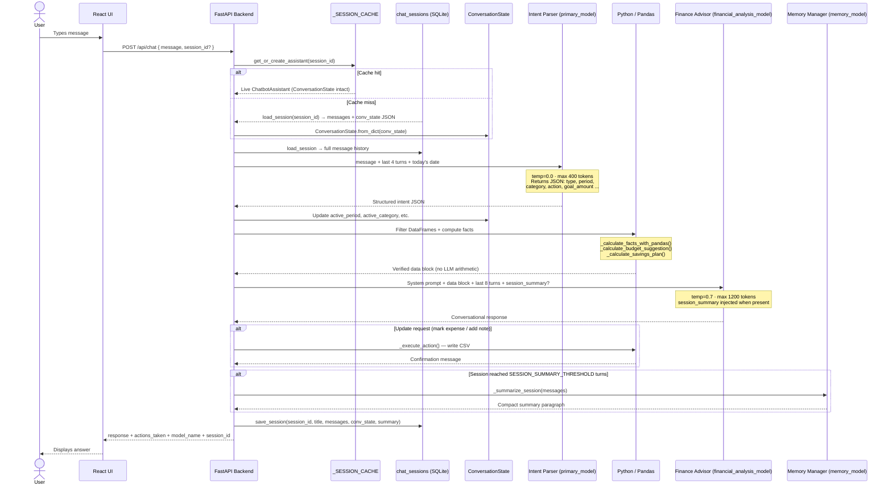

# Chatbot Two-Model Pipeline

**Source file:** `src/ai_analysis/chatbot_assistant.py`  
**Entry method:** `ChatbotAssistant.process_message()`

---

## Overview

The chatbot uses a **two-model pipeline** to answer financial questions accurately without hallucinating numbers. The models play separate, non-overlapping roles:

| Role | Model (from `config/llm_models.json`) | Purpose |
|------|---------------------------------------|---------|
| **Intent Parser** | `primary_model` (e.g. `qwen3.5:9b`) | Converts natural language → structured JSON |
| **Finance Advisor** | `financial_analysis_model` (e.g. `ALIENTELLIGENCE/financialadvisor`) | Converts verified data → conversational response |
| **Memory Manager** | `memory_model` (e.g. `hermes3`) | Summarises long sessions so context survives beyond the context window |

Python + pandas sits between them and performs all actual calculations — neither model touches raw numbers directly.

---

## Pipeline Diagram



---

## Why Two Models?

### The Hallucination Problem

If a single LLM were handed raw CSVs and asked "how much did I spend on dining in October?", it would read a subset of rows, do mental arithmetic, and often return a wrong total — especially for large datasets. The error is silent; the user has no way to know.

### The Solution: Pandas as Ground Truth

Python pandas computes all numbers. Neither model performs arithmetic. The finance model receives a pre-computed data block and is explicitly instructed:

> "Answer using ONLY the data shown above — never invent numbers. DO NOT multiply totals — they are already complete sums."

### Why Two Models Instead of One?

The intent parsing step runs at **temperature 0.0** — deterministic JSON extraction. The finance advisor runs at **temperature 0.7** — warm, conversational prose. These are opposing requirements. Using a single model would force a compromise on both. Splitting the roles also means:

- The intent model can be a smaller, faster model (lower latency)
- The finance model can be domain-tuned for financial advice
- Each can be swapped independently in `config/llm_models.json`

---

## Conversation State

`ConversationState` is a dataclass that persists across turns within a single chat session:

| Field | Set when | Used for |
|-------|----------|---------|
| `active_period` | User mentions a month/year | Follow-up questions inherit the same period |
| `active_months_window` | "last N months" | Rolling window filter |
| `active_category` | User mentions a category | Category-scoped follow-ups |
| `active_merchant` | User mentions a merchant | Merchant drill-down |
| `savings_goals` | User sets a goal | Recalculation on goal changes |
| `budget_targets` | User sets a budget per category | Budget tracking and advice |
| `monthly_savings_target` | User sets a savings target | Savings plan recalculation |

**Example:**
```
Turn 1: "how much did I spend on dining in October?"
         → active_period = "2025-10", active_category = "Dining"

Turn 2: "what restaurant was the most expensive?"
         → no period or category in message
         → state still has active_period = "2025-10", active_category = "Dining"
         → query correctly scoped to Dining in October
```

`ConversationState` is serialised via `to_dict()` / `from_dict()` and stored in the
`chat_sessions` table so it survives server restarts.

---

## Session Persistence

Every conversation is stored in `chat_sessions` (SQLite DB):

| Column | Description |
|--------|-------------|
| `session_id` | UUID-4 hex key |
| `title` | Auto-generated from first 60 chars of first user message |
| `created_at` / `updated_at` | ISO timestamps |
| `messages` | Full JSON message log `[{role, content}, ...]` |
| `conv_state` | Serialised `ConversationState` JSON |
| `summary` | Hermes-generated compact context (null until session grows long) |

A module-level `_SESSION_CACHE: Dict[str, ChatbotAssistant]` keeps live instances
in memory so hot sessions never pay a DB round-trip or model config reload.

### Session endpoints

| Method | Path | Description |
|--------|------|-------------|
| `GET` | `/api/chat/sessions` | List all sessions |
| `GET` | `/api/chat/sessions/{id}` | Get full message history |
| `DELETE` | `/api/chat/sessions/{id}` | Delete session |
| `POST` | `/api/chat` | Send a message; pass `session_id` to continue a session |

---

## Memory Management (Hermes)

When a session reaches `SESSION_SUMMARY_THRESHOLD = 20` assistant turns the
`memory_model` (e.g. `hermes3`) is asked to compress older turns:

> "Summarise the following conversation into a single compact paragraph that
> captures the financial questions asked, the key data points discussed, any goals
> or budgets mentioned, and the time periods referenced. 3–5 sentences."

The summary is stored in `chat_sessions.summary`.  On subsequent turns it is
injected into the finance advisor's system prompt as a **Session Memory** block,
so the advisor retains full context even when the raw message window is trimmed
to 8 turns.

To enable: set `"memory_model": "hermes3"` (or any compatible Ollama model) in
`config/llm_models.json`.  Leave empty to disable (the advisor uses only the raw
8-turn window).

---

## Fallback Mode

If Ollama is unreachable, the primary model call fails, or the JSON response is malformed, `_regex_intent_fallback()` runs instead. It uses regular expressions to extract:
- Intent type (budget / savings / income / expense)
- Period (month name, "last month", "this year", "last N months")
- Category (synonym mapping, e.g. "restaurants" → `"Dining"`)
- Action (total / average / max / list)

The remaining steps (pandas computation and finance model) are unaffected by which intent parser ran.

---

## Configuration

All models are set in `config/llm_models.json`:

```json
{
  "primary_model": "gemma4:31b",
  "secondary_model": "",
  "financial_analysis_model": "ALIENTELLIGENCE/financialadvisor",
  "memory_model": "hermes3"
}
```

Any Ollama model can be substituted. The container entrypoint auto-pulls any model listed here that is not yet present on the host.

---

## Debug Log

Every chatbot turn writes a debug file to `logs/llm_prompt_debug.txt` inside the container:

```
USER:        how much did i spend on dining last month?
INTENT:      { "type": "expense_query", "period": "2026-02", "category": "Dining", ... }
CONV STATE:  period=2026-02  category=Dining  merchant=None
SESSION SUMMARY (Hermes):   [present when memory model has run]
PANDAS DATA:
  Period: 2026-02
  Transactions analyzed: 23
  ...
```

This is the fastest way to diagnose unexpected chatbot answers — it shows exactly what data the finance model received.

To read it from a running container:
```bash
docker exec automated-budgeting cat logs/llm_prompt_debug.txt
```
