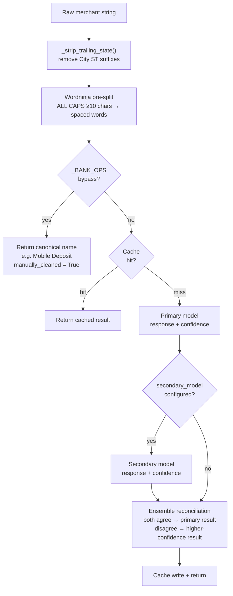

# LLM Merchant Name Cleaning

**Source files:**  
- `src/statement_parser/llm_utils.py` — LLM client and ensemble logic  
- `src/statement_parser/parser.py` — `_clean_merchant_name_with_llm()`, `_load_user_corrections_from_csvs()`

---

## The Problem

Raw merchant names from bank statements are not human-friendly:

| Raw (from PDF) | Cleaned |
|----------------|---------|
| `SQ *BLUE BIRD CAFE #4 AUSTIN T` | `Blue Bird Cafe` |
| `AMZN MKTP US*2X3Y4Z5W6` | `Amazon` |
| `WA WA 1234` | `Wawa` |
| `TST* THE LOCAL EATERY` | `The Local Eatery` |
| `WHOLEFDS #00123 AUSTIN TX` | `Whole Foods` |

The cleaning pipeline uses a local LLM (via Ollama) to handle the wide variety of bank-specific formatting, POS prefixes, store numbers, and location suffixes.

---

## Pipeline Overview



---

## Ollama Integration

Requests are sent to the Ollama REST API at `http://localhost:11434/api/chat`.

Request format:
```json
{
  "model": "qwen2.5:14b",
  "messages": [
    {
      "role": "system",
      "content": "You are a financial assistant. Clean bank transaction merchant names..."
    },
    {
      "role": "user",
      "content": "Clean this merchant name: WHOLEFDS #00123 AUSTIN TX"
    }
  ],
  "think": false,
  "stream": false
}
```

The `think` parameter is set to `false` to suppress chain-of-thought output (faster responses, lower token usage).

---

## Multi-Model Ensemble

When `secondary_model` is set (non-empty) in `config/llm_models.json`, two models are queried:

| Setting | Value |
|---------|------|
| Primary model | configured `primary_model` |
| Secondary model | configured `secondary_model` |

**Reconciliation logic:**
1. If both models return the same cleaned name → high confidence result
2. If models disagree:
   - Primary model confidence ≥ threshold → use primary
   - Primary model confidence < threshold → use secondary (or flag for review)

**When to use single-model mode:**  
Set `"secondary_model": ""` (empty string) to disable the ensemble and use only the primary model. Single-model mode still works well; the ensemble primarily helps with ambiguous merchant names.

---

## Merchant Cache

### Source
The cache is built from existing processed CSV files. When `_load_user_corrections_from_csvs()` runs, it reads every CSV in `src/ui/data/statements/` and collects all `(raw_merchant → cleaned_merchant)` pairs.

### Frequency-Based Confidence

Each cached mapping has a frequency count (how many times it appeared across all CSVs):

| Frequency | Confidence Tier |
|-----------|----------------|
| 5+ times | High — used directly, no LLM call |
| 2–4 times | Medium — used with note |
| 1 time | Low — used but allows LLM override |

This means the more months of history you have, the fewer LLM calls are made — the system gets faster over time.

### Cache Key

```python
cache_key = raw_merchant.upper().strip()
```

Normalization is minimal (uppercase, stripped whitespace) to maximize hit rate without masking meaningful differences.

---

## Configuration: `config/llm_models.json`

```json
{
  "primary_model": "qwen3.5:9b",
  "secondary_model": "",
  "financial_analysis_model": "ALIENTELLIGENCE/financialadvisor"
}
```

| Key | Purpose |
|-----|---------|
| `primary_model` | Merchant cleaning + transaction categorization + chatbot intent parsing |
| `secondary_model` | Optional second model for ensemble cleaning. Set to `""` to disable. |
| `financial_analysis_model` | Conversational financial advice in the chatbot (step 2 responses) |

**Changing models:**  
Any model installed in Ollama can be used. Larger models (14b, 32b) produce better cleaning results but are slower. Update this file and restart the container — the entrypoint auto-pulls any model listed here that is not yet present.

Browse all available models at [https://ollama.com/search](https://ollama.com/search).

To check installed models:
```bash
ollama list
```

To install a model manually:
```bash
ollama pull mistral:7b
```

---

## Prompt Design

The system prompt instructs the LLM to:
- Return only the cleaned merchant name (no explanation)
- Remove store numbers, transaction IDs, POS codes, and location suffixes
- Standardize capitalization (Title Case)
- Preserve brand name accuracy (e.g., return `"McDonald's"` not `"Mcdonalds"`)
- Return the original string unchanged if it is already clean

The minimal response format (name only) keeps processing fast and avoids JSON parsing overhead.

---

## Common Cleaning Patterns

| Pattern | Example Input | Expected Output |
|---------|--------------|----------------|
| POS prefix (`SQ *`, `TST*`, `SP `) | `SQ *BLUE BIRD` | `Blue Bird` |
| Store number | `WALMART #4521` | `Walmart` |
| Reference code | `AMZN MKTP US*2X3Y` | `Amazon` |
| Address suffix | `SHELL OIL 12345 MAIN ST` | `Shell` |
| All caps | `STARBUCKS COFFEE` | `Starbucks` |
| Abbreviation | `MCK APTS` / `MCDNLDS` | `McKinley Apartments` / `McDonald's` |

---

## Debugging Merchant Cleaning

To test a single merchant name through the full clean pipeline, use the CLI processor on a test month, or temporarily add a print statement to `_clean_merchant_name_with_llm()` in `parser.py` for local debugging.

---

## Performance Notes

- First run (cold cache, no CSV history): every transaction goes to Ollama — slowest
- After several months of history: most common merchants hit cache — very fast
- `qwen2.5:14b` on CPU: ~1–3 seconds per LLM call
- `qwen2.5:14b` on GPU: ~0.1–0.3 seconds per LLM call
- Parallel batch processing is a [planned improvement](FUTURE_FEATURES.md#10-performance-parallel-llm-processing)
