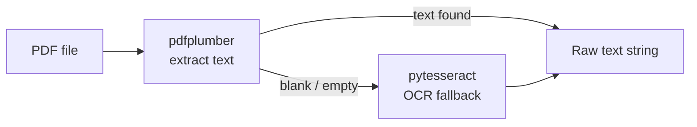

# PDF Parsing Pipeline

**Source file:** `src/statement_parser/parser.py`  
**Entry class:** `StatementParser`

---

## Overview

The parser takes a raw bank or credit card PDF and produces a list of structured transaction dictionaries. Each transaction contains:

| Field | Example | Notes |
|-------|---------|-------|
| `date` | `2025-06-15` | Normalized to `YYYY-MM-DD` |
| `type` | `DEBIT` / `CREDIT` | Inferred from context |
| `merchant` | `Whole Foods Market` | After LLM cleaning |
| `amount` | `42.15` | Always positive float |
| `label` | `expense` / `income` / `transfer` | High-level class |

---

## Step-by-Step Pipeline

### 1. PDF Text Extraction (`pdf_extractor.py`)

Uses **pdfplumber** to extract raw text from each page. pdfplumber preserves the spatial layout of text, which is critical for correctly reading multi-column bank statement formats.

The OCR fallback (`pytesseract`) is used when pdfplumber returns empty or near-empty text — typically for scanned PDFs (photos of paper statements).



### 2. Bank / Institution Detection

`detect_bank_name()` runs on the first page of text and tries four strategies in order:

| Strategy | Example match |
|----------|--------------|
| Issuer phrase | `"issued by First National Bank"` |
| Institution phrase | `"Chase Bank Member FDIC"` |
| Domain / URL | `"firstnational.com"` detected in text |
| Generic fallback | Returns `"Unknown Bank"` |

The detected bank name is stored on the parser instance and included with each transaction.

### 3. Account Type Detection

`is_credit_card` is a boolean property derived from keywords in the statement header:
- Credit card keywords: `"credit"`, `"visa"`, `"mastercard"`, `"discover"`, `"amex"`, `"card"`
- Absence of these keywords → bank account (debit / checking / savings)

This affects how amounts are interpreted: credit card statements often show spending as positive numbers with separate payment rows, whereas some bank statements show debits as negative.

### 4. Date Pattern Matching

Four date formats are recognized:

| Format | Example | Regex notes |
|--------|---------|------------|
| Long month name | `June 15, 2025` | `\w+ \d{1,2}, \d{4}` |
| Short month name | `Jun 15 2025` | `\w{3} \d{1,2} \d{4}` |
| Numeric with dashes | `2025-06-15` | ISO 8601 |
| No year (statement year inferred) | `06/15` | Appends `YYYY` from statement header |

After parsing, dates are normalized to `YYYY-MM-DD` by `_fix_date_parsing_errors()`, which corrects common issues:
- Day/month transposition
- Two-digit years
- Future-dated transactions that should be in the prior year (December statement with January dates)

### 5. Transaction Row Extraction

The core extraction loop walks lines of text and builds transaction records by matching:

1. A **date** at the start of the line
2. An **amount** (dollar value) anywhere on the line or the next line
3. A **description / merchant** — the text between date and amount

Multi-line transactions (where the merchant description spans two lines) are handled by a carry-forward buffer.

### 6. Amount Sign Inference

- Amounts are always stored as **positive floats**
- The `type` field (`DEBIT` / `CREDIT`) carries sign meaning
- If a description ends with `CR` or the column alignment indicates a credit, the transaction is marked `CREDIT`
- Bank account debits and credit card charges both become `type: DEBIT`

### 7. Pre-LLM Merchant Cleaning: `_strip_trailing_state()`

Before sending a merchant name to the LLM, state/province abbreviations are stripped:

```
"MERCHANT NAME City ST"  →  "MERCHANT NAME City"
"MERCHANT CITYST"        →  "MERCHANT"
```

**Rules:**
- Two-capital-letter suffix that is a valid US state abbreviation
- Must be preceded by a space or fused onto the city name
- City prefix must be ≥ 4 characters (prevents false positives like `"OK"` for Oklahoma)
- Runs before all other cleaning to reduce noise in LLM prompts

### 7a. Wordninja Pre-split

All-caps merchant strings that are 10 or more characters long and contain no spaces are split into words using wordninja before being passed to the LLM:

```
"FIXITFORWARD"  →  "Fix It Forward"
```

This prevents the LLM from receiving a single unbroken uppercase token it cannot decode.

### 7b. Bank Operation Bypass (`_BANK_OPS`)

Certain well-known bank operation descriptions are assigned canonical names directly, bypassing the LLM entirely:

| Raw description | Canonical name |
|-----------------|---------------|
| `MOBILE DEPOSIT` | `Mobile Deposit` |
| `DIRECT DEPOSIT` | `Direct Deposit` |
| `ACH DEPOSIT` | `ACH Deposit` |
| `COUNTER DEPOSIT` | `Counter Deposit` |
| `NIGHT DEPOSIT` | `Night Deposit` |

Matching is done with `str.startswith()` on the uppercased description, so variants like `"MOBILE DEPOSIT 11/05"` are caught. These are marked `manually_cleaned = True` and skip all LLM validation.

### 8. Transfer Detection: `filter_transfers()`

Reads `config/transfer_keywords.json`. Any transaction whose description contains a listed keyword is labeled `transfer` and excluded from expense and income totals.

Example keywords: `"ACH TRANSFER"`, `"ONLINE TRANSFER"`, `"ZELLE TO"`, `"TRSF"`

### 9. Payment App Detection

Reads `config/payment_apps.json`. Transactions matching payment apps (Venmo, Zelle, Cash App, PayPal, etc.) are flagged as `needs_review` because the actual merchant identity is in the memo/note, not the description.

These appear in the UI's **Review** queue for manual merchant/category assignment.

### 10. Income Detection

Reads `config/income_keywords.json`. If the merchant/description matches an income keyword (e.g., employer name, `"DIRECT DEPOSIT"`, `"PAYROLL"`), the transaction is labeled `income` instead of `expense`.

Note: `_BANK_OPS` entries such as `Direct Deposit` are resolved before this stage — they bypass the LLM and arrive at income detection with a clean canonical name already set.

### 11. Balance-as-Amount Detection

When pdfplumber collapses a multi-column PDF layout, a transaction row may contain the running account balance rather than the transaction amount. The parser detects this by comparing each extracted amount to the previous row's running balance:

- If `amount == previous_balance` (within \$0.01), the transaction is flagged `_suspicious_balance = True`
- Flagged transactions are routed to the **manual review** queue instead of expenses or income
- A warning is printed: `⚠ Suspicious amount (= prev balance $X.XX): Merchant Date — routed to manual review`

The user can then supply the correct amount via the dashboard's Transactions tab.

---

## Class Reference: `StatementParser`

**Constructor:**
```python
StatementParser(pdf_path: str, month: str)
```

**Key methods:**

| Method | Description |
|--------|-------------|
| `parse()` | Main entry point; returns list of transaction dicts |
| `detect_bank_name(text)` | Identifies issuing institution from header text |
| `_strip_trailing_state(name)` | Strips US state abbreviations from merchant strings |
| `filter_transfers(transactions)` | Removes inter-account transfers |
| `_fix_date_parsing_errors(date_str)` | Normalizes edge-case date formats |
| `_load_user_corrections_from_csvs()` | Loads merchant history from existing CSVs for cache seeding |
| `classify_transactions(transactions, is_bank_account)` | Routes transactions to income, expenses, or manual review |

---

## Known Limitations

- **PDF format dependency**: Each bank uses a different PDF layout. A bank statement using non-standard column orders may need a custom extraction rule.
- **Scanned PDFs**: OCR accuracy depends on scan quality. Poor scans may produce garbled merchant names.
- **No table extraction**: pdfplumber table mode is not used; line-by-line parsing handles most formats but can be confused by complex multi-column layouts.
- **Single page per PDF**: If a long statement spans many pages, the date-inference logic assumes year continuity across pages.
- **Balance column collapse**: Some PDFs (e.g., FNBO) produce a layout where pdfplumber reads the running balance column instead of the transaction amount column. The balance-as-amount detector (step 11) catches the most obvious case but cannot guarantee detection for every bank format.
